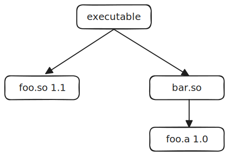

# 符号隐藏

## 概述
在真实的项目中, 有许多需要依赖第三方库的场景, 某些第三方的动态库中又会包含其依赖的静态库信息, 但当此静态库的其余版本又被引入项目时, 便出现了一个库的多个版本同时存在的场景.  


此时有可能会导致许多问题, 解决思路就是隐藏间接引入的依赖库符号, 有两种解决办法
* 编译 `foo` 的静态库时, 使用 `-fvisibility=hidden`
* 在 `bar` 链接 `foo` 时, 链接选项增加 `-Wl,--exclude-libs,foo` 或 `-Wl,--exclude-libs,ALL`

## 例子
此项目展示了同时存在一个库的多个版本的场景
* baz 为可执行文件, 依赖于动态库: foo 1.1, bar 1.0 和 bob 1.0
* foo 1.1 为动态库
* bar 1.0 为动态库, 依赖于静态库 foo 1.0
* foo 1.0 为静态库, 使用 `-fvisibility=hidden` (CMake: C_VISIBILITY_PRESET hidden)
* bob 1.0 为动态库, 依赖于静态库 foo 1.2, 链接时使用 `-Wl,--exclude-libs,ALL`
* foo 1.2 为静态库

依赖关系可表示为
```
baz
├── foo.so.1.1.0
│
├── bar.so.1.0.0
│   └── foo.a (1.0.0)
│
└── bob.so.1.0.0
    └── foo.a (1.2.0)
```

编译完成后, 运行 `baz` 便可看到同时调用了多个不同版本的 `foo`. 更直观的, 可以通过 `readelf -s` 来观察符号的可见性
