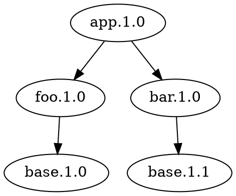

## 说明link顺序的例子

### 依赖关系
当前有依赖关系如下


### app
当前app中只是简单的调用foo和bar的方法
```
foo_say();
bar_say();
```

### foo
foo是动态库, 依赖于base-1.0版本, 仅仅打印出base的版本号
```
void foo_say()
{
	printf("foo say: base version is: %s\n", base_ver());
}
```

### bar
bar是动态库, 依赖于base-1.1版本, 除了打印出版本号之外, 还调用了在base-1.1版本中新增加的函数`base_say_hello`
```
void bar_say()
{
	printf("bar.base say: %s\n", base_say_hello());
	printf("bar say: base version is: %s\n", base_ver());
}
```

### base
两个版本的base均编译为静态库

### 编译并运行
运行`build.sh`, 当前可以看到最终的输出结果为
```
---------------------------------
foo.base sym
0000000000001141 g     F .text  000000000000000d              base_ver

bar.base sym
0000000000001172 g     F .text  000000000000000d              base_ver
000000000000117f g     F .text  000000000000000d              base_say_hello

---------------------------------
run app
foo say: base version is: 1.0
bar.base say: hello world
bar say: base version is: 1.0
```
首先使用objdump确认了`foo`使用的是`base-1.0`版本, 而`bar`使用的是`base-1.1`版本. 此时运行`app`的结果是base的版本号均打印出1.0, 而`bar`中`base-1.1`版本的函数也运行正常. 这是由于当前的链接顺序为先链接`foo`, 再链接`bar`.  
现在调整链接的顺序为先链接`bar`, 再链接`foo`
```
target_link_libraries(app
    ${BAR_LIBRARIES}
    ${FOO_LIBRARIES}
)
```

发现结果为
```
---------------------------------
run app
foo say: base version is: 1.1
bar.base say: hello world
bar say: base version is: 1.1
```

这是由于`gcc`的链接顺序导致的, 原始的顺序相当于
```
gcc app.c -I $pkg_dir/include -L $pkg_dir/lib -lfoo -lbar -o build/app
```

而调整之后的顺序相当于
```
gcc app.c -I $pkg_dir/include -L $pkg_dir/lib -lbar -lfoo -o build/app
```

**简而言之, 如果链接的依赖中有一个库的多个版本, 应该把需要的那个放在link更前面的位置.**   
**同时也要注意依赖问题, 比如B依赖于A, 则A应该出现在B之后.**  
